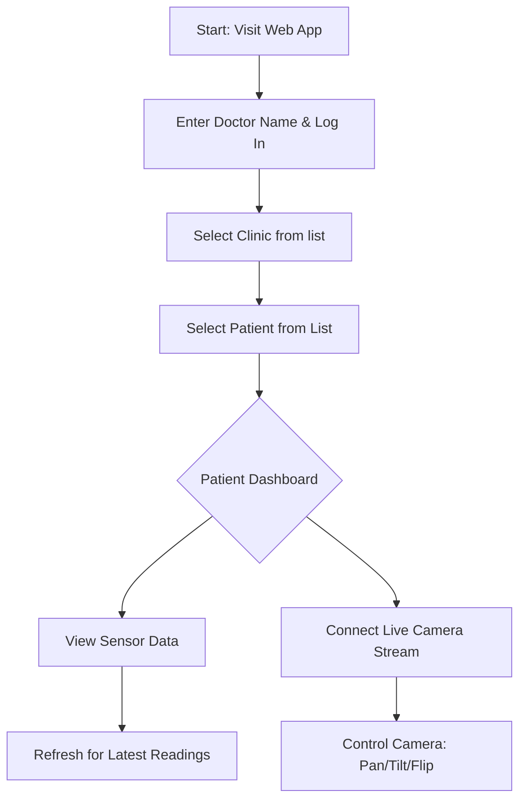
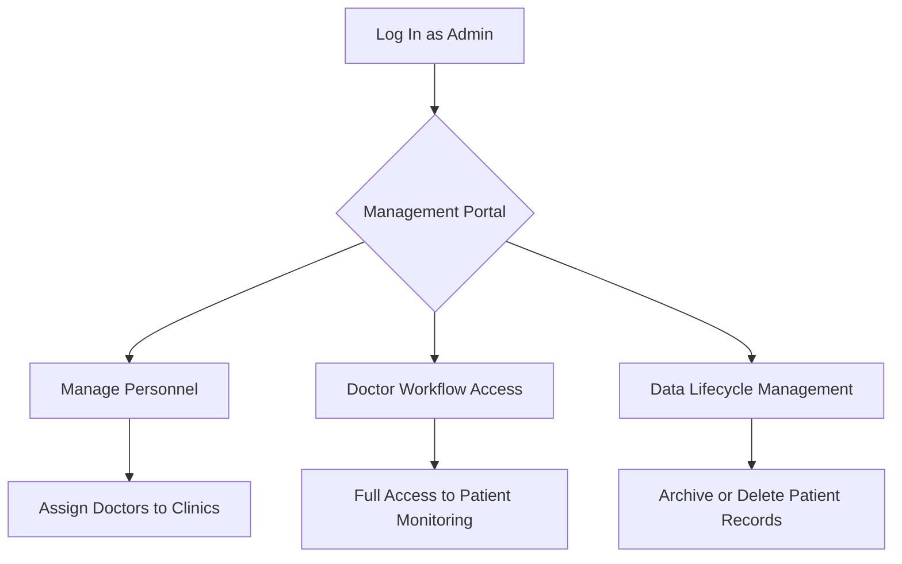

# Medicart User Flows

This document details the intended user flows for the Medicart web application, covering both the current Doctor dashboard and the planned Administration features.

---

## Doctor Flow
The primary workflow for medical staff to monitor patient vitals and camera feeds.

### Steps:
1. **Authentication**: Enter "Doctor name" and click **Log In**.
2. **Clinic Selection**: Choose a clinic from the available list populated from the server.
3. **Patient Selection**: Once a clinic is selected, a list of active patients for that clinic is displayed.
4. **Data Review**:
    - **Telemetry**: View historical and live sensor recordings (Heart Rate, BP, Glucose, etc.).
    - **Visuals**: Establish a WebSocket connection for live camera feedback and use PTZ (Pan-Tilt-Zoom) controls.

---

## Administrator Flow (Planned)
The administrative layer for managing system state and access.

### Steps:
1. **Personnel Management**: 
    - Create/Update doctor profiles.
    - Map specific doctors to clinics (regulating which clinics they see upon login).
2. **Monitoring**:
    - Admins have identical access to the Doctor Dashboard for all clinics and patients.
3. **Data Control**:
    - Ability to **Delete Data**: Remove specific record entries or entire patient directories (not currently available to doctors).
    - Manage storage cleanup (moving files to long-term storage).

---

## Flow Implementation Status

| Feature | Status | Note |
| :--- | :--- | :--- |
BACK END COMPLETED

| Clinic/Patient Navigation | Implemented | Dynamic fetching via API. |
| Data Visualization | Implemented | JSON-based record display. |
| Camera Streaming | Implemented | WebSocket binary stream. |

NOT COMLPETED YET FROM BACK END SIDE

| Doctor Login | planned | Simple login. |
| Admin Portal | Planned | UI and specific API routes pending. |
| Delete Records | Planned | File-system deletion API required. |
| Doctor-to-Clinic Mapping | Planned | Requires persistent configuration mapping. |
